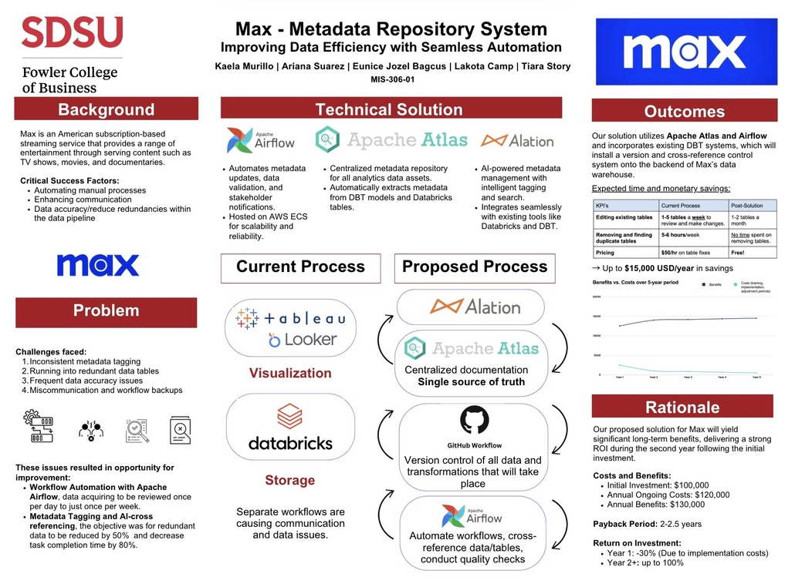

# max Metadata Repository System

### Systems Analysis & Process Improvement Case Study

This academic systems analysis project examined data management and workflow challenges within max's Data Analytics environment. Through stakeholder interviews and process analysis, our team identified issues involving metadata management, data integrity, redundant data, communication, and workflow coordination.

We analyzed the current-state environment and designed a proposed future-state process focused on centralized metadata documentation, version control, and workflow automation.

> **Project Context:** This project was completed for MIS 306: Information Systems Analysis at San Diego State University. The proposed solution and projected outcomes were developed for academic purposes and were not implemented by max.

## Business Problem

Our analysis identified several challenges affecting the efficiency and reliability of max's Data Analytics workflows:

- Inconsistent metadata tagging and documentation
- Redundant and duplicate data tables
- Data accuracy and integrity issues
- Communication gaps between teams
- Disconnected workflows contributing to delays and rework

These challenges made it more difficult to locate reliable data, understand existing data assets, coordinate changes, and maintain consistent documentation.

## Analysis Approach

Our team conducted stakeholder interviews and applied the **PIECES framework** to evaluate the existing environment across six areas:

- **Performance** — workflow delays and process inefficiencies
- **Information** — data integrity, metadata, and documentation
- **Economics** — costs associated with inefficient or redundant processes
- **Control** — data governance, version control, and quality
- **Efficiency** — duplicated effort and unnecessary manual work
- **Service** — communication and information accessibility

These findings helped us document the current-state environment, define system requirements, and develop the proposed future-state process.

## Proposed Solution

The team proposed a centralized metadata repository designed to improve documentation, data governance, and coordination across the analytics workflow.

The proposed solution incorporated:

- **Alation & Apache Atlas** — metadata management and documentation
- **GitHub** — version control and change tracking
- **Apache Airflow** — workflow automation and data quality checks

The future-state process was designed to reduce redundant data, strengthen documentation standards, improve communication, and make data assets easier to manage and locate.

## Projected Outcomes

Our team estimated that the proposed solution could result in:

- **50% reduction** in redundant data
- **80% reduction** in time spent editing existing tables
- **80% reduction** in time spent identifying and removing duplicate tables
- Up to **$15,000 in estimated annual savings**

> These figures represent projected outcomes from the team's academic analysis and were not measured implementation results.

## Project Visual

The project poster below summarizes the current-state process, identified problems, proposed technical solution, future-state process, and projected outcomes.

## Project Contribution

This semester-long project was completed collaboratively by our MIS 306 team. We conducted stakeholder interviews, analyzed existing processes, documented system requirements, developed current- and future-state process models, and evaluated potential improvements.

The final recommendations, technical solution, and projected outcomes represent the collective work of the project team.
